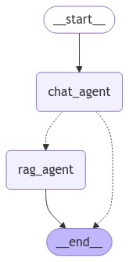

## Questions

## 1. Describe the default chunking strategy that you will use.

Chunking enables better handling of large documents, ensures context is maintained, and optimizes the retrieval and generation capabilities of language models. It's a foundational technique to manage complexity and ensure that NLP applications can process and interact with large volumes of text effectively.

For first pass I decided to use the RecursiveCharacterTextSplitter with a chunk size of 1200 and an chunk overlap of 100. This size strikes a balance between capturing substantial information and not losing too much context when breaking sections. By using this range, we can ensure that sections like headings, definitions, and lists stay together. Add overlap of about 100 to 200 characters between chunks. This helps preserve context when the text gets split mid-sentence or mid-thought, ensuring smooth transitions. The NIST and Blueprint documents likely contain detailed, interconnected ideas. A larger chunk size (1000-1500 characters) ensures that related information stays together, minimizing the risk of losing important context. Overlap ensures no loss of context across adjacent chunks, which is crucial for coherent question-answering tasks in downstream NLP applications like Retrieval-Augmented Generation (RAG).

```
    text_splitter = RecursiveCharacterTextSplitter(
        chunk_size=1200,
        chunk_overlap=100,
        length_function=tiktoken_len,
    )
```

## 2. How did you choose your stack, and why did you select each tool the way you did?

Great question. When selecting our stack, we evaluated several options, ultimately choosing a combination of LangGraph and LangChain as the core architecture for our two-agent system.

For the vector store, we opted for Qdrant due to its efficiency and speed in handling vector-based storage. This is crucial for managing and retrieving chunked document data. On the front end, we utilized Chainlit to provide an interactive UI for users to engage with the application. The entire system is deployed on Hugging Face, which simplifies deployment and scalability. Also we first used the "text-embedding-3-small" embedding model by Open AI for the intial setup for this stack.

LangChain was essential in allowing us to build chains of actions, such as retrieval, prompt enhancement, and generating responses using a Large Language Model (LLM). In our case, we’re using GPT-4o, which is a top-tier LLM for most use cases.



The diagram above illustrates our two-agent architecture. By using LangGraph, we designed the system with a graph-like flow, where each node represents an agent. In a typical Retrieval-Augmented Generation (RAG) setup, a user’s query triggers data retrieval from the vector database based on vector embedding similarity. However, since our application is built as a chatbot (via Chainlit), users may follow up with additional questions that relate to the already retrieved context. It would be inefficient to retrieve the same context repeatedly for each follow-up. Moreover, users might input statements that aren't queries at all.

To address these cases, we designed a "context agent" that determines when a new retrieval is needed. It only triggers retrieval when a fresh query is received that can't be answered with the current context. The "chatrag agent" then generates the response and performs any necessary retrieval.

We also implemented streaming through LangGraph/LangChain's astream_events, enabling the application to provide faster response times.

## 3. What conclusions can you draw about performance and effectiveness of your pipeline with this information? 

### Evaluation Metrics

| Metric              | Score  |
|---------------------|--------|
| Faithfulness        | 0.9638 |
| Answer Relevancy    | 0.9650 |
| Context Recall      | 1.0000 |
| Context Precision   | 0.8278 |
| Answer Correctness  | 0.8136 |

### Interpretation of Results

#### Faithfulness (0.9638)
- This high score indicates that the system's responses are highly consistent with the provided context.
- The RAG model is doing an excellent job of staying true to the information in the knowledge base.

#### Answer Relevancy (0.9650)
- The very high relevancy score suggests that the system is providing answers that are closely aligned with the questions asked.
- Users are likely to find the responses pertinent to their queries.

#### Context Recall (1.0000)
- A perfect score in context recall is exceptional, indicating that the system is retrieving all relevant information from the knowledge base for each query.
- This suggests that the retrieval component of the RAG system is highly effective.

#### Context Precision (0.8278)
- While good, this score is lower than the other metrics, suggesting that the system sometimes retrieves more information than necessary.
- There might be room for improvement in fine-tuning the retrieval process to be more precise.

#### Answer Correctness (0.8136)
- This score, while good, indicates that there's some room for improvement in the accuracy of the answers provided.
- It's the lowest score among the metrics, suggesting that this could be a primary area of focus for enhancement.

### Conclusions and Recommendations

1. **Overall Performance**: The RAG system is performing very well, with particularly strong results in faithfulness, relevancy, and recall. This indicates a robust and reliable system that users can trust for accurate information retrieval.

2. **Strengths**: 
   - The perfect context recall score is a significant achievement, ensuring comprehensive information retrieval.
   - High faithfulness and relevancy scores indicate that the system provides responses that are both accurate and on-topic.

3. **Areas for Improvement**:
   - Focus on enhancing context precision. This could involve refining the retrieval algorithm to be more selective in the information it pulls from the knowledge base.
   - Work on improving answer correctness. This might require fine-tuning the language model or improving the way retrieved context is utilized in generating answers.

4. **Next Steps**:
   - Conduct a detailed error analysis on instances where answer correctness was lower to identify patterns or specific types of questions that are challenging for the system.
   - Experiment with different retrieval mechanisms or parameters to improve context precision without sacrificing recall.
   - Consider implementing a confidence scoring system for answers, potentially allowing the system to request human intervention for low-confidence responses.
   - Regularly update and refine the knowledge base to ensure the most current and accurate information is available to the system.

5. **User Impact**: Based on these metrics, users are likely to have a very positive experience with the system, receiving relevant and faithful answers. However, continued work on answer correctness will further enhance user trust and satisfaction.


## 4. How did you choose the embedding model for this application? 


The model was uploaded to https://huggingface.co/rgtlai/ai-policy-ft. The notebook that shows the training can be seen at src/sdg/Fine_Tuned.ipynb and src/sdg/Fine_Tuned2.ipynb. 

I choose the Snowflake/snowflake-arctic-embed-m embedding model because it is lightweight as it has embedding dimension of 768 and 110 million parameters. It should perform well when it it is fine tuned.

I was able to fine tune it but for some reason Ragas was not running the way it did before. Perhaps I have some library conflict that will be resolved in a later date. For now the model seems to be running. It seems to work just as well as the "text-embedding-3-small" even though the notebook notebook src/sdg/Fine_Tuned.ipynb showed it was able to be trained but  src/sdg/Fine_Tuned2.ipynb was not able to run with RAGAS unlike src/sdg/Ragas.ipynb

## 5. Test the fine-tuned embedding model using the RAGAS frameworks to quantify any improvements.  Provide results in a table. Test the two chunking strategies using the RAGAS frameworks to quantify any improvements. Provide results in a table. Which one is the best to test with internal stakeholders next week, and why

## 6. What is the story that you will give to the CEO to tell the whole company at the launch next month? 

## AI Initiative: Empowering Ethical AI Understanding Across the Enterprise

### Executive Summary

Our AI initiative has successfully developed an innovative tool to address the growing need for AI education and ethical guidance within our organization. This chatbot leverages cutting-edge RAG (Retrieval-Augmented Generation) technology to provide our employees with accurate, context-aware information on AI ethics, policies, and industry developments.

### Key Achievements

1. **Data-Driven Insights**: Incorporated authoritative sources like the "Blueprint for an AI Bill of Rights" and the NIST AI Risk Management Framework.
2. **Advanced Technology Stack**: Utilized state-of-the-art open-source tools and models to create a robust, scalable solution.
3. **Performance Optimization**: Implemented fine-tuned embedding models and optimized data chunking strategies to enhance accuracy and relevance.
4. **Rigorous Evaluation**: Employed the RAGAS framework to quantify and improve the system's performance across key metrics.

### Impact and Benefits

- **Informed Workforce**: Empowers employees with up-to-date knowledge on AI ethics and policies.
- **Risk Mitigation**: Promotes responsible AI development and use across the organization.
- **Innovation Catalyst**: Positions our company at the forefront of ethical AI adoption and implementation.
- **Scalable Solution**: Built to evolve with emerging AI technologies and regulations.

### Next Steps

1. **User Testing**: Engaging 50+ internal stakeholders for feedback and refinement.
2. **Continuous Improvement**: Regular updates with latest AI policy information, including recent White House briefings.
3. **Expansion**: Potential to extend the tool's capabilities to address broader AI-related queries and challenges.

This initiative demonstrates our commitment to responsible AI innovation and positions us as industry leaders in ethical AI adoption.


There appears to be important information not included in our build, for instance, the 270-day update on the 2023 executive order on Safe, Secure, and Trustworthy AI.  How might you incorporate relevant white-house briefing information into future versions? 

## Strategy for Incorporating New Governmental AI Information

### 1. Establish a Dedicated Update Team

- Form a cross-functional team responsible for monitoring, evaluating, and incorporating new AI policy information.
- Include members from legal, AI ethics, data science, and engineering departments.
- Assign clear roles and responsibilities for content curation, technical implementation, and quality assurance.

### 2. Implement an AI-Powered Content Monitoring System

- Develop or adopt an AI-based system to continuously scan official government websites, including:
  - WhiteHouse.gov
  - NIST.gov
  - AI.gov
- Configure the system to identify and flag new publications related to AI policy, ethics, and regulations.
- Set up automated alerts for the update team when new relevant content is detected.

### 3. Establish a Structured Review Process

1. **Initial Screening**:
   - Automatically categorize new content based on relevance and priority.
   - Have team members perform a quick review to confirm relevance and importance.

2. **In-depth Analysis**:
   - Assign team members to thoroughly review flagged documents.
   - Identify key points, new guidelines, or policy changes.
   - Create summaries and extract relevant quotes.

3. **Integration Planning**:
   - Determine how new information fits into the existing knowledge base.
   - Identify any conflicts with current content and plan for resolution.
   - Decide on the appropriate level of detail to include.

4. **Technical Implementation**:
   - Update the RAG system's document corpus with new information.
   - Adjust embeddings and fine-tune models if necessary.
   - Update metadata and tagging for improved retrieval.

5. **Quality Assurance**:
   - Conduct thorough testing to ensure new information is correctly integrated.
   - Verify that the system provides accurate and up-to-date responses.
   - Check for any unintended effects on existing functionalities.

### 4. Develop a Versioning and Changelog System

- Implement a versioning system for the knowledge base to track changes over time.
- Maintain a detailed changelog documenting all updates, including:
  - Date of update
  - Source of new information
  - Summary of changes
  - Impact on existing content

### 5. Create a User Communication Plan

- Develop a strategy to inform users about significant updates to the system.
- Consider implementing an in-app notification system for major policy changes.
- Provide a way for users to access both current and historical information.

### 6. Establish Partnerships and Expert Consultations

- Build relationships with AI policy experts in academia and industry.
- Consider partnering with legal firms specializing in AI and technology policy.
- Regularly consult with these experts to ensure proper interpretation and implementation of new policies.

### 7. Implement Feedback Loops

- Create mechanisms for users to provide feedback on the relevance and accuracy of AI policy information.
- Regularly review user feedback to identify areas for improvement or gaps in coverage.

### 8. Conduct Regular System Audits

- Schedule quarterly audits of the entire knowledge base to ensure consistency and relevance.
- Use these audits to identify outdated information that needs to be updated or removed.

### 9. Develop a Rapid Response Protocol

- Create a process for quickly incorporating critical updates (e.g., executive orders or urgent policy changes).
- Define criteria for triggering the rapid response protocol.
- Establish a streamlined approval process for emergency updates.

### 10. Continuous Improvement of Update Process

- Regularly review and refine the update process itself.
- Stay informed about advancements in natural language processing and information retrieval to improve the system's capabilities.


